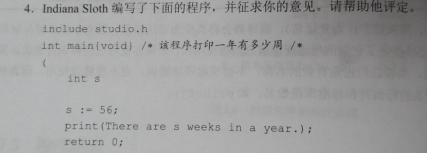

# <center>2.11复习题</center>

##### 4. Indiana Sloth 编写了下面的程序，并征求你的意见，请帮他评定。


```c
// 错误示例
include studio.h
int main{void} /* 这程序打印一年有多少周 /*
{
    int s

    s :=56;
    printf(There are s weeks in a year.);
    return 0;
```

```c
// 修改后
/* 这程序打印一年有多少周 */
#include <stdio.h>
int main(void)
{
    int s;

    s = 56;
    printf("There are %d weeks in a year.", s);
    return 0;
}
```

##### 7.如何以下面的格式输出变量 word 和 lines 的值（这里，3020和350代表两个变量的值）？

##### There were 3020 words and 350 lines.

```c
#include <stdio.h>
int main(void)
{
    int word,lines;
    printf("There were %d words and %d lines.\n",word,linens)
}
