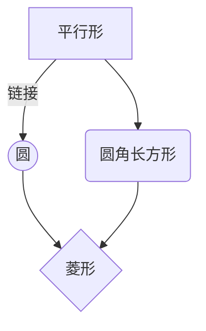
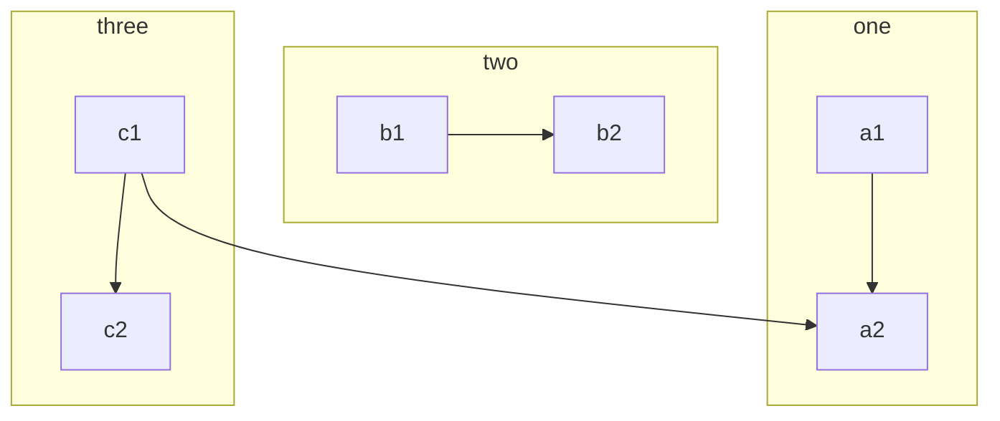
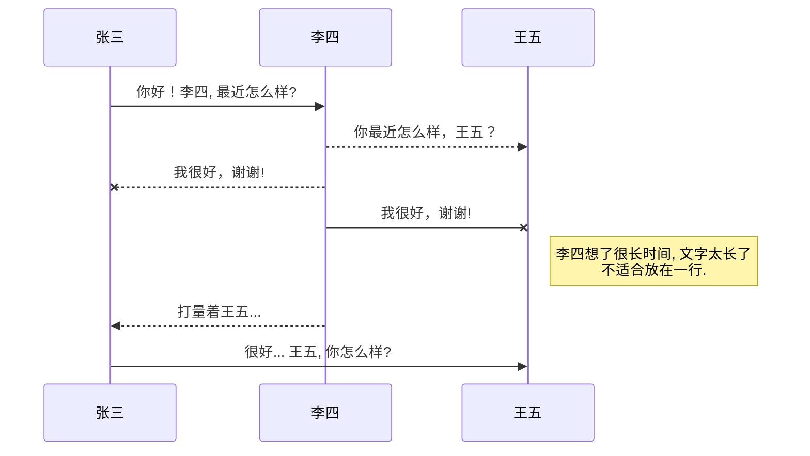
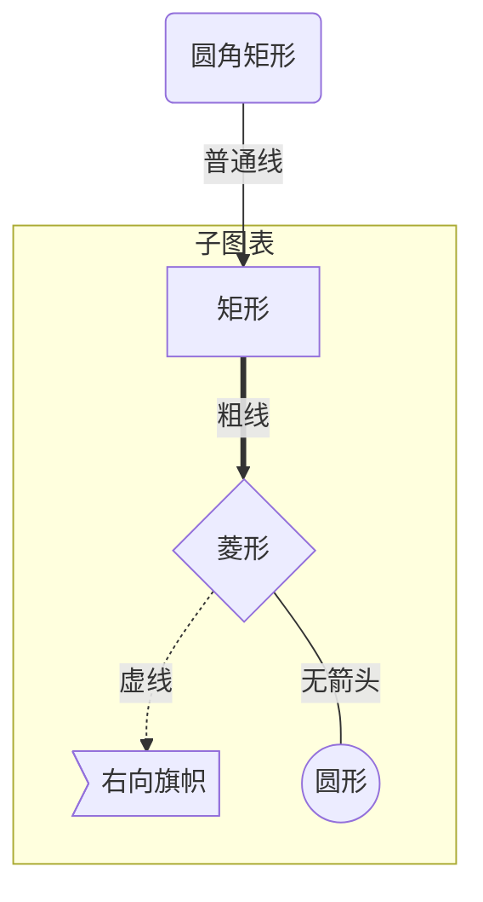
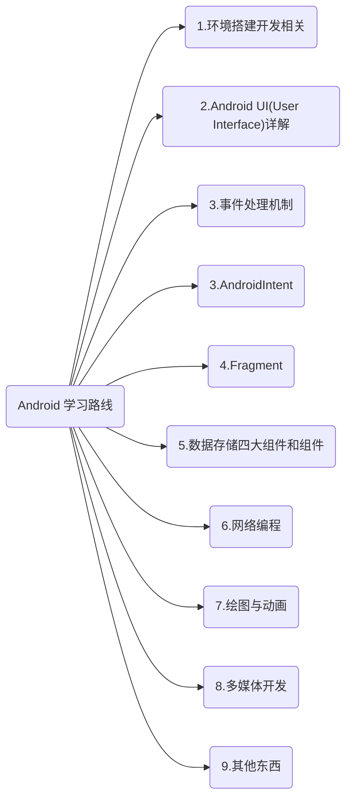
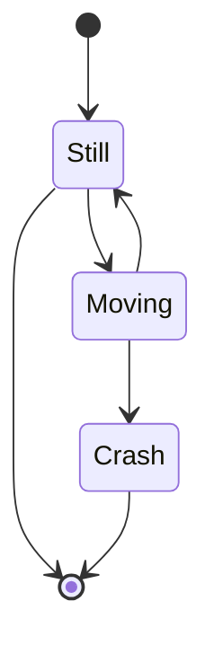

|      Android 版本       |       版本名        | API |       发布时间       |
| :---------------------: | :-----------------: | :-: | :------------------: |
|           10            |          Q          | 29  |      2019\-9\-3      |
|            9            |   Pie（AndroidP\)   | 28  |      2018\-8\-7      |
|          8\.1           |  Oreo（Android O）  | 27  |     2017\-12\-05     |
|            8            |  Oreo（Android O）  | 26  |       2017\-03       |
|      7\.1/7\.1\.1       |       Nought        | 25  |       2016\-10       |
|            7            |       Nought        | 24  |       2016\-08       |
|         6\.0\.1         |     Marshmallow     | 23  |       2015\-12       |
|            6            |     Marshmallow     | 23  |       2015\-10       |
|      5\.1/5\.1\.1       |      Lollipop       | 22  |     2015\-03/04      |
|  5\.0/5\.0\.1/5\.0\.2   |      Lollipop       | 21  |     2014\-11/12      |
| 4\.4w/4\.4w\.1/4\.4w\.2 |       Kitkat        | 20  |    2014\-06/09/10    |
|  4\.4/4\.4\.1~4\.4\.4   |       Kitkat        | 19  |  2013\-10/2014\-06   |
|      4\.3/4\.3\.1       |    JellyBeanmr2     | 18  |        41465         |
|      :-----------:      |       :-----:       |
|  4\.2/4\.2\.1/4\.2\.2   |    JellyBeanmr1     | 17  | 2012\-11-11/2013\-02 |
|  4\.1/4\.1\.1/4\.1\.2   |      JellyBean      | 16  |    2012\-07/07/10    |
|     4\.0\.3/4\.0\.4     | IceCreamSandwishmr1 | 15  |  2011\-12/2012\-03   |
|  4\.0/4\.0\.1/4\.0\.2   |  IceCreamSandwish   | 14  |    2011\-10/10/11    |
|  3\.2/3\.2\.1~3\.2\.6   |    Honeycombmr2     | 13  |    2011\-07/2012     |
|         3\.1\.x         |    Honeycombmr1     | 12  |       2011\-05       |
|         3\.0\.x         |      Honeycomb      | 11  |       2011\-02       |
|     2\.3\.3~2\.3\.7     |   Gingerbreadmr1    | 10  | 2010-11\-02/2011\-09 |
|  2\.3/2\.3\.1/2\.3\.2   |     Gingerbread     |  9  | 2010\-12-12/2011\-01 |
|  2\.2/2\.2\.1~2\.2\.3   |        Froyo        |  8  | 2010\-05/2011\-01-11 |
|         2\.1\.x         |      Eclairmr1      |  7  |       2010\-01       |
|         2\.0\.1         |     Eclair_0_1      |  6  |       2009\-12       |
|            2            |       Éclair        |  5  |       2009\-10       |
|          1\.6           |        Donut        |  4  |       2009\-09       |
|          1\.5           |       Cupcake       |  3  |       2009\-04       |
|          1\.1           |      Base_1_1       |  2  |       2009\-02       |
|            1            |        Base         |  1  |       2008\-09       |

@import "E:\ZM\v scode\README.md"
@import "https://hello-chen-1300561671.cos.ap-chengdu.myqcloud.com/Resource%20directory/README.md"

8多媒体开发7绘图与动画6网络编程Android学习路线9其他一些东西

